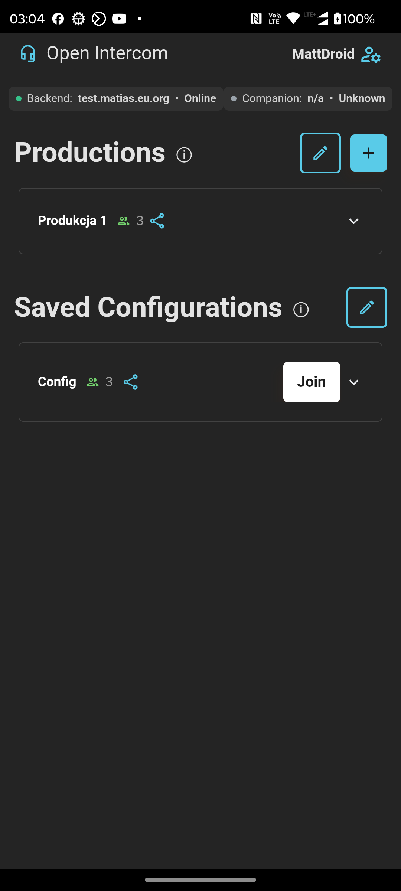
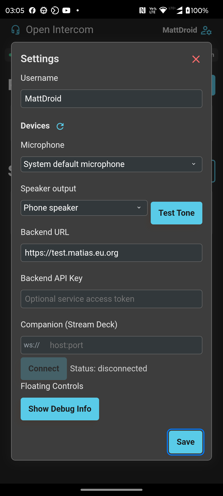
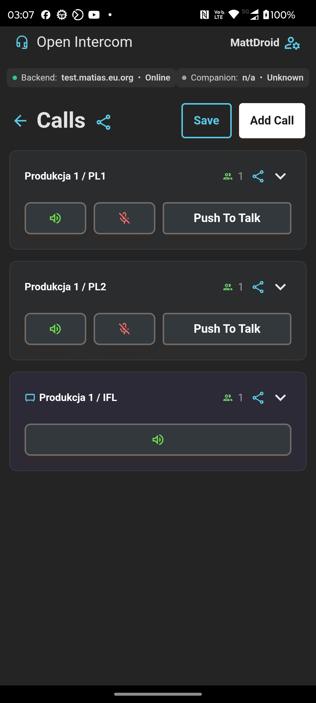
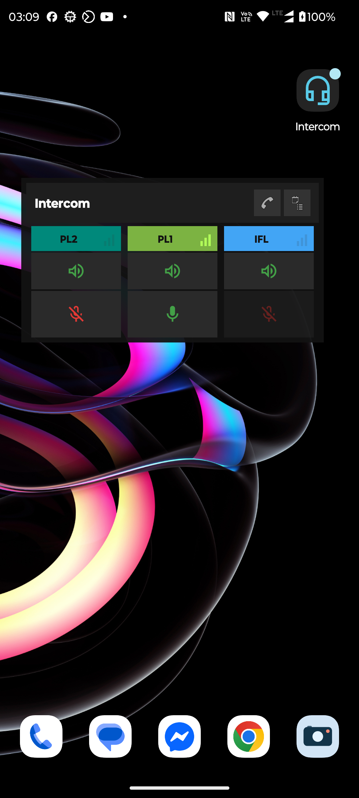

# Android App (Capacitor)

The Android app wraps the existing React/Vite intercom client in a native Android shell using [Capacitor](https://capacitorjs.com/). The goal is to keep the web app as the primary product surface while adding Android-only capabilities that are difficult or unavailable in a browser: foreground call state, native audio-route controls, notification-backed services, and floating controls.

## Screens

These screenshots were captured from the Android app running on a connected device.

| Production list | Settings | Calls | Floating controls |
| --- | --- | --- | --- |
|  |  |  |  |

## Differences from the web app

The Android app uses the same React UI and API layer as the web app, but it is built with the Android entry point (`src/main.android.tsx`) and served inside Capacitor's WebView instead of a desktop/mobile browser tab.

Key differences:

- Mobile-only settings include Backend URL and Backend API Key fields so an installed APK can be pointed at a manager instance without rebuilding.
- Android speaker routing is exposed through a native audio-route selector instead of the browser output-device picker.
- The app can show backend and Companion status in the mobile shell.
- Native foreground services keep call and floating-control state available while the app is active or moved away from the foreground.
- Floating controls are provided through a native overlay service and require Android overlay permission.
- WebView debugging is enabled only for debuggable builds.
- Android allows selected mixed-content cases for local `ws://` Companion workflows inside the WebView; production deployments should prefer TLS and `wss://`.

The web app remains the better fit for desktop operation, keyboard-heavy workflows, and standard browser deployment. The Android app is optimized for mobile operators who need a dedicated installed client.

## Pros and cons of a native Android app

### Pros

- **Installed operator experience:** users launch a dedicated app instead of managing a browser tab.
- **Native audio integration:** Android-specific microphone, speaker, Bluetooth, and audio-mode behavior can be handled through native code.
- **Foreground call behavior:** call state can be represented with Android foreground services and notifications.
- **Floating controls:** operators can keep push-to-talk and call controls available outside the main app UI.
- **Device deployment:** APK distribution can target managed Android devices without depending on browser setup.

### Cons

- **More platform maintenance:** the project now has web, Capacitor, Gradle, Android SDK, and device-permission surfaces to keep working.
- **WebView differences:** WebRTC, autoplay, device labels, permission prompts, mixed content, and audio routing can behave differently from Chrome or Safari.
- **Release overhead:** signed APK/AAB builds, keystores, Android permissions, and store or device-management distribution add operational work.
- **Native permission friction:** microphone, notification, Bluetooth, and overlay permissions may require extra user or device-admin steps.
- **Debugging split:** issues may cross React, Capacitor bridge, Android services, and WebView runtime boundaries.

## Implementation overview

The Android app is intentionally thin around the existing frontend:

- `capacitor.config.ts` defines the app id (`com.eyevinn.intercom`), display name, `dist` web directory, and Android scheme.
- `vite.config.android.ts` swaps the web entry point for `src/main.android.tsx`.
- `src/main.android.tsx` bootstraps mobile support with `bootstrapMobile()` and renders the regular `App` inside `MobileShell`.
- `src/platform.ts` gates Android-only behavior with `Capacitor.getPlatform() === "android"`.
- `src/components/mobile/` contains mobile settings, status, audio route selection, foreground-service managers, Companion integration, and startup permission handling.
- `src/mobile-overlay/` contains the TypeScript bridge layer for overlay controls and call-state synchronization.
- `android/app/src/main/java/com/eyevinn/intercom/` contains the native Capacitor plugins and services:
  - `OverlayBubblePlugin` and `OverlayService` implement floating controls.
  - `AudioRoutePlugin` exposes Android audio-route and Bluetooth behavior.
  - `CallServicePlugin` and `CallService` manage notification-backed call state.
  - `AppControlPlugin` exposes app/build control helpers to the web layer.
  - `MainActivity` registers plugins, enables debug-only WebView inspection, and applies WebView settings.

The Android manifest declares the permissions needed for this surface: network access, microphone recording, audio settings, Bluetooth, overlay windows, foreground services, and notifications.

## Branch and upstream PR strategy (`android-app-v2`)

Work is split so Eyevinn can review web and mobile separately:

1. **Packaging** — `android/`, Capacitor deps/scripts, `docs/android.md`, release APK workflow, CPU scripts
2. **HTTP layer** — `src/config.ts`, `src/http.ts`, `src/api/api.ts` (web behavior unchanged)
3. **Mobile modules** — `src/mobile-overlay/`, `src/components/mobile/`, `yarn build:android`
4. **Extension hooks** — `MobileProviders` / `MobileRoutes` in `App.tsx`, production-line bridge

Web CI uses `npm run build` (entry `src/main.tsx`). Android uses `npm run build:android` (entry `src/main.android.tsx`).

## CI

- [`.github/workflows/android-apk-build.yml`](../.github/workflows/android-apk-build.yml) — builds debug and release APKs when a tag is pushed (`v*`, `android-v*`) or via manual dispatch; uploads workflow artifacts.
- [`.github/workflows/android-apk-release.yml`](../.github/workflows/android-apk-release.yml) — attaches release APKs when a GitHub Release is published.

## Prerequisites

- Node 20 and Yarn Classic
- Android Studio (latest), Android SDKs, and an emulator or device
- Java 17 (Gradle Toolchain can install it automatically)

## Install dependencies

From `intercom-frontend`:

```
yarn
yarn add -D @capacitor/cli @capacitor/android
yarn add @capacitor/core
```

The project includes `capacitor.config.ts` and package scripts to streamline setup.

## Configure backend for mobile builds

At build time, you can set your backend URL and tokens as environment variables, then build. Alternatively, on mobile the app exposes Backend URL and Backend API Key fields in User Settings (these fields are hidden in the web build).

```
export VITE_BACKEND_URL=https://<your-intercom-manager>/
# Optional for OSC-hosted dev
export VITE_BACKEND_API_KEY=<service-access-token>
export OSC_ACCESS_TOKEN=<personal-access-token>

yarn build
```

Notes:

- For local development on an Android emulator, `localhost` inside the WebView is not your host machine. Use `http://10.0.2.2:<port>` to reach a service running on your host.
- For a physical device, use your host’s LAN IP, and ensure both are on the same network.

## Add Android platform

```
yarn cap:add:android
```

This generates `android/` with a native project. If you updated web assets, run:

```
yarn android:build   # builds web and syncs to Android project
```

## Open in Android Studio

```
yarn android:open
```

Then Run ➝ Run ‘app’ to start on an emulator or connected device.

## Permissions required (microphone/WebRTC)

Open `android/app/src/main/AndroidManifest.xml` and ensure these permissions are present:

```
<uses-permission android:name="android.permission.INTERNET" />
<uses-permission android:name="android.permission.ACCESS_NETWORK_STATE" />
<uses-permission android:name="android.permission.RECORD_AUDIO" />
<uses-permission android:name="android.permission.MODIFY_AUDIO_SETTINGS" />
<!-- Optional for headsets/Bluetooth on newer Android versions -->
<uses-permission android:name="android.permission.BLUETOOTH" />
<uses-permission android:name="android.permission.BLUETOOTH_CONNECT" />
```

If you need to connect to an `http://` backend during development, either:

- Set `server.androidScheme` and network security to allow cleartext, or
- Prefer `https://` to keep a secure context for WebRTC.

To allow cleartext just for development, set on the `<application>` tag:

```
android:usesCleartextTraffic="true"
```

## Live reload (optional)

You can point the native app at the Vite dev server for faster iteration.

1. Start Vite dev server:

```
yarn dev
```

2. In `capacitor.config.ts`, set the server to your dev URL (emulator example):

```
server: {
  url: 'http://10.0.2.2:5173',
  androidScheme: 'http'
}
```

3. Run on device/emulator with live reload:

```
yarn cap:run:android
```

When switching back to bundled assets, remove the `server.url` and run:

```
yarn android:build
```

## WebRTC notes

- Android WebView supports WebRTC; user permission prompts are forwarded by Capacitor.
- Make sure your backend uses valid TLS certificates in production for a proper secure context.
- Autoplay rules still apply; user interaction may be required to start audio.

## Building a release APK/AAB

Use Android Studio: Build ➝ Generate Signed Bundle / APK.
Follow the wizard to create a keystore and sign. Remember to run `yarn android:build` before creating a release.

## Troubleshooting

- Microphone prompt doesn’t appear: verify manifest permissions and test on Android 10+.
- Cannot reach backend from emulator: use `10.0.2.2` instead of `localhost`.
- CORS issues against remote backend: ensure backend allows your app’s origin; for OSC, use the service access token as documented in the frontend README.

## Remote Debugging WebViews

WebView remote debugging is enabled for debug builds. Steps:

1. Enable Developer Options and USB debugging on your Android device.
2. Connect your device via USB (or use an emulator).
3. On your desktop Chrome, open `chrome://inspect` and click "Discover USB devices".
4. Your app’s WebView should appear under Remote Target. Click "inspect" to open DevTools.

Note: WebView debugging is enabled via `WebView.setWebContentsDebuggingEnabled(true)` in `MainActivity` for debug builds only.

- Security: the Backend API Key is stored locally on the device (app storage/localStorage). Treat it as sensitive and rotate if exposed.
